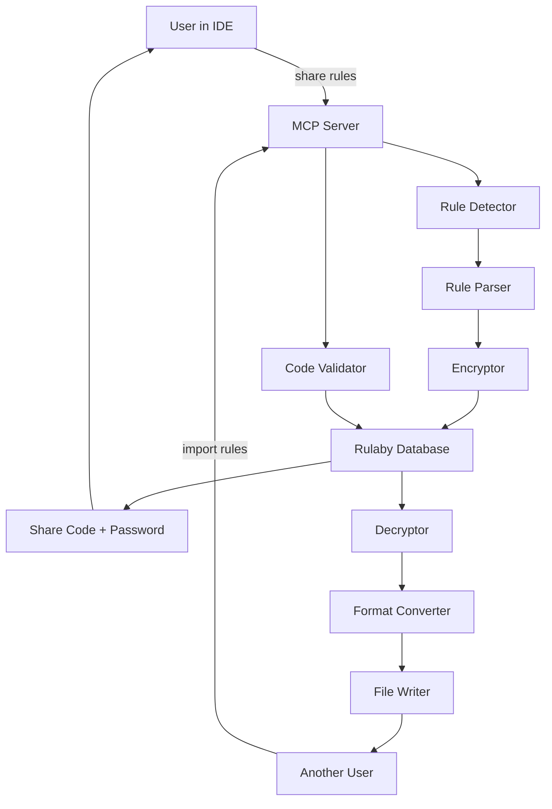

# MVP Technical Design - Rulaby Rule Sharing

## 🏗️ System Architecture



## 📁 Rule File Detection Strategy

### IDE Detection Logic
```typescript
interface IDEConfig {
  name: string;
  ruleFiles: string[];
  detectPatterns: string[];
}

const IDE_CONFIGS: IDEConfig[] = [
  {
    name: 'cursor',
    ruleFiles: ['.cursorrules'],
    detectPatterns: ['cursor', 'cursorless']
  },
  {
    name: 'windsurf',
    ruleFiles: ['.windsurfrules'],
    detectPatterns: ['windsurf', 'codeium']
  },
  {
    name: 'claude-code',
    ruleFiles: ['.claude/CLAUDE.md', 'CLAUDE.md'],
    detectPatterns: ['claude-code', 'anthropic']
  },
  {
    name: 'gemini-cli',
    ruleFiles: ['.gemini/rules.md'],
    detectPatterns: ['gemini', 'google-ai']
  },
  {
    name: 'kiro',
    ruleFiles: ['.kiro/prompts.md'],
    detectPatterns: ['kiro']
  }
];
```

## 🔄 Rule Format Conversion

### Universal Rule Format (URF)
```typescript
interface UniversalRuleFormat {
  version: '1.0';
  metadata: {
    sourceIDE: string;
    created: Date;
    author?: string;
  };
  rules: {
    general: string[];
    codeStyle: string[];
    behavior: string[];
    projectSpecific: string[];
    customSections: Record<string, string[]>;
  };
}
```

### Conversion Matrix
| From/To | Cursor | Windsurf | Claude-Code | Gemini-CLI | Kiro |
|---------|---------|----------|-------------|------------|------|
| Cursor | ✓ | Convert | Convert | Convert | Convert |
| Windsurf | Convert | ✓ | Convert | Convert | Convert |
| Claude-Code | Convert | Convert | ✓ | Convert | Convert |
| Gemini-CLI | Convert | Convert | Convert | ✓ | Convert |
| Kiro | Convert | Convert | Convert | Convert | ✓ |

## 🔐 Encryption Implementation

### Encryption Flow
```typescript
import crypto from 'crypto';

interface EncryptionResult {
  encryptedData: string;
  salt: string;
  iv: string;
  authTag: string;
}

class RuleEncryptor {
  private algorithm = 'aes-256-gcm';
  
  async encrypt(data: string, password: string): Promise<EncryptionResult> {
    // Generate salt
    const salt = crypto.randomBytes(16).toString('hex');
    
    // Derive key from password
    const key = crypto.pbkdf2Sync(password, salt, 100000, 32, 'sha256');
    
    // Generate IV
    const iv = crypto.randomBytes(16);
    
    // Create cipher
    const cipher = crypto.createCipheriv(this.algorithm, key, iv);
    
    // Encrypt data
    let encrypted = cipher.update(data, 'utf8', 'hex');
    encrypted += cipher.final('hex');
    
    // Get auth tag
    const authTag = cipher.getAuthTag();
    
    return {
      encryptedData: encrypted,
      salt: salt,
      iv: iv.toString('hex'),
      authTag: authTag.toString('hex')
    };
  }
  
  async decrypt(encryptedData: EncryptionResult, password: string): Promise<string> {
    // Derive key from password
    const key = crypto.pbkdf2Sync(password, encryptedData.salt, 100000, 32, 'sha256');
    
    // Create decipher
    const decipher = crypto.createDecipheriv(
      this.algorithm, 
      key, 
      Buffer.from(encryptedData.iv, 'hex')
    );
    
    // Set auth tag
    decipher.setAuthTag(Buffer.from(encryptedData.authTag, 'hex'));
    
    // Decrypt
    let decrypted = decipher.update(encryptedData.encryptedData, 'hex', 'utf8');
    decrypted += decipher.final('utf8');
    
    return decrypted;
  }
}
```

## 🔑 Share Code Generation

### Code Format: `RULABY-XXXX-XXXX`
```typescript
class ShareCodeGenerator {
  private readonly charset = 'ABCDEFGHJKLMNPQRSTUVWXYZ23456789'; // No I,O,0,1
  
  generate(): string {
    const part1 = this.randomString(4);
    const part2 = this.randomString(4);
    return `RULABY-${part1}-${part2}`;
  }
  
  private randomString(length: number): string {
    let result = '';
    for (let i = 0; i < length; i++) {
      result += this.charset[Math.floor(Math.random() * this.charset.length)];
    }
    return result;
  }
}

class PasswordGenerator {
  generate(): string {
    const words = ['Thunder', 'Storm', 'Crystal', 'Phoenix', 'Dragon'];
    const symbols = ['!', '@', '#', '$', '%', '&'];
    const numbers = Math.floor(Math.random() * 90) + 10; // 10-99
    
    const word1 = words[Math.floor(Math.random() * words.length)];
    const symbol = symbols[Math.floor(Math.random() * symbols.length)];
    const word2 = words[Math.floor(Math.random() * words.length)];
    
    return `${word1}${symbol}${word2}${numbers}`;
  }
}
```

## 🗄️ Database Schema

### PostgreSQL Schema
```sql
-- Main shares table
CREATE TABLE rule_shares (
  id UUID PRIMARY KEY DEFAULT gen_random_uuid(),
  share_code VARCHAR(14) UNIQUE NOT NULL,
  encrypted_data TEXT NOT NULL,
  encryption_metadata JSONB NOT NULL, -- {salt, iv, authTag}
  source_ide VARCHAR(20) NOT NULL,
  rule_metadata JSONB, -- {fileCount, totalSize, preview}
  created_at TIMESTAMP WITH TIME ZONE DEFAULT NOW(),
  expires_at TIMESTAMP WITH TIME ZONE DEFAULT NOW() + INTERVAL '30 days',
  access_count INTEGER DEFAULT 0,
  max_access_count INTEGER DEFAULT NULL,
  is_active BOOLEAN DEFAULT true
);

-- Access logs for analytics
CREATE TABLE share_access_logs (
  id UUID PRIMARY KEY DEFAULT gen_random_uuid(),
  share_id UUID REFERENCES rule_shares(id),
  target_ide VARCHAR(20),
  accessed_at TIMESTAMP WITH TIME ZONE DEFAULT NOW(),
  success BOOLEAN,
  error_message TEXT
);

-- Indexes
CREATE INDEX idx_share_code ON rule_shares(share_code);
CREATE INDEX idx_expires_at ON rule_shares(expires_at);
CREATE INDEX idx_created_at ON rule_shares(created_at);
```

## 🛠️ MCP Server Implementation

### New Tools for mcp-server/src/tools/ruleSharing.ts
```typescript
import { Tool } from '@modelcontextprotocol/sdk/types.js';
import { RuleDetector } from '../services/ruleDetector.js';
import { RuleEncryptor } from '../services/ruleEncryptor.js';
import { RuleConverter } from '../services/ruleConverter.js';
import { ShareCodeGenerator, PasswordGenerator } from '../services/generators.js';

export const shareRulesTool: Tool = {
  name: 'share_rules',
  description: 'Share your IDE rules with others',
  inputSchema: {
    type: 'object',
    properties: {
      includeProjectSpecific: {
        type: 'boolean',
        description: 'Include project-specific rules',
        default: true
      },
      expiresInDays: {
        type: 'number',
        description: 'Number of days before share expires',
        default: 30
      },
      maxUses: {
        type: 'number',
        description: 'Maximum number of times rules can be imported',
        default: null
      }
    }
  }
};

export const importRulesTool: Tool = {
  name: 'import_rules',
  description: 'Import shared rules into your IDE',
  inputSchema: {
    type: 'object',
    properties: {
      shareCode: {
        type: 'string',
        description: 'The share code (e.g., RULABY-XXXX-XXXX)'
      },
      password: {
        type: 'string',
        description: 'The password for decryption'
      },
      targetIDE: {
        type: 'string',
        description: 'Target IDE (auto-detected if not specified)',
        enum: ['cursor', 'windsurf', 'claude-code', 'gemini-cli', 'kiro']
      }
    },
    required: ['shareCode', 'password']
  }
};
```

## 🔄 Implementation Workflow

### Share Rules Flow
```typescript
async function handleShareRules(request: ToolCallRequest) {
  // 1. Detect current IDE
  const currentIDE = await RuleDetector.detectCurrentIDE();
  
  // 2. Find and read rule files
  const ruleFiles = await RuleDetector.findRuleFiles(currentIDE);
  
  // 3. Parse rules to URF
  const urf = await RuleParser.parseToURF(ruleFiles, currentIDE);
  
  // 4. Generate share code and password
  const shareCode = ShareCodeGenerator.generate();
  const password = PasswordGenerator.generate();
  
  // 5. Encrypt rules
  const encrypted = await RuleEncryptor.encrypt(
    JSON.stringify(urf), 
    password
  );
  
  // 6. Store in database
  await database.storeShare({
    shareCode,
    encrypted,
    sourceIDE: currentIDE,
    metadata: urf.metadata
  });
  
  // 7. Return to user
  return {
    shareCode,
    password,
    message: `Your ${currentIDE} rules have been shared successfully!`
  };
}
```

### Import Rules Flow
```typescript
async function handleImportRules(request: ToolCallRequest) {
  const { shareCode, password, targetIDE } = request.params;
  
  // 1. Validate share code
  const share = await database.getShare(shareCode);
  if (!share || !share.is_active) {
    throw new Error('Invalid or expired share code');
  }
  
  // 2. Check access limits
  if (share.max_access_count && share.access_count >= share.max_access_count) {
    throw new Error('Share code has reached maximum uses');
  }
  
  // 3. Decrypt rules
  const decrypted = await RuleEncryptor.decrypt(share.encrypted, password);
  const urf = JSON.parse(decrypted);
  
  // 4. Detect or use specified target IDE
  const ide = targetIDE || await RuleDetector.detectCurrentIDE();
  
  // 5. Convert URF to target format
  const convertedRules = await RuleConverter.fromURF(urf, ide);
  
  // 6. Write rule files
  await RuleWriter.writeRules(convertedRules, ide);
  
  // 7. Update access count
  await database.incrementAccessCount(shareCode);
  
  // 8. Log access
  await database.logAccess(share.id, ide, true);
  
  return {
    message: `Rules imported successfully to ${ide}!`,
    filesCreated: convertedRules.files
  };
}
```

## 📊 Monitoring & Analytics

### Key Metrics to Track
1. **Share Metrics**
   - Total shares created
   - Shares by source IDE
   - Average rules per share
   - Share expiration rate

2. **Import Metrics**
   - Total successful imports
   - Import success rate
   - Cross-IDE conversion matrix
   - Most popular rule sections

3. **Error Metrics**
   - Failed decryptions (wrong password)
   - Expired share attempts
   - Conversion failures
   - File write errors

## 🚀 MVP Deployment Plan

### Infrastructure
- **Database**: Supabase PostgreSQL
- **MCP Server**: Docker container on Railway
- **Monitoring**: Basic logging to CloudWatch
- **Backup**: Daily database snapshots

### Environment Variables
```env
# Database
DATABASE_URL=postgresql://...

# Encryption
ENCRYPTION_PEPPER=random-server-secret

# Limits
MAX_SHARE_SIZE_KB=100
MAX_SHARES_PER_DAY=10
DEFAULT_EXPIRY_DAYS=30

# Feature Flags
ENABLE_ANALYTICS=true
ENABLE_RATE_LIMITING=true
```

---

**Document Version**: 1.0  
**Last Updated**: 2025-01-23  
**Status**: Ready for Development